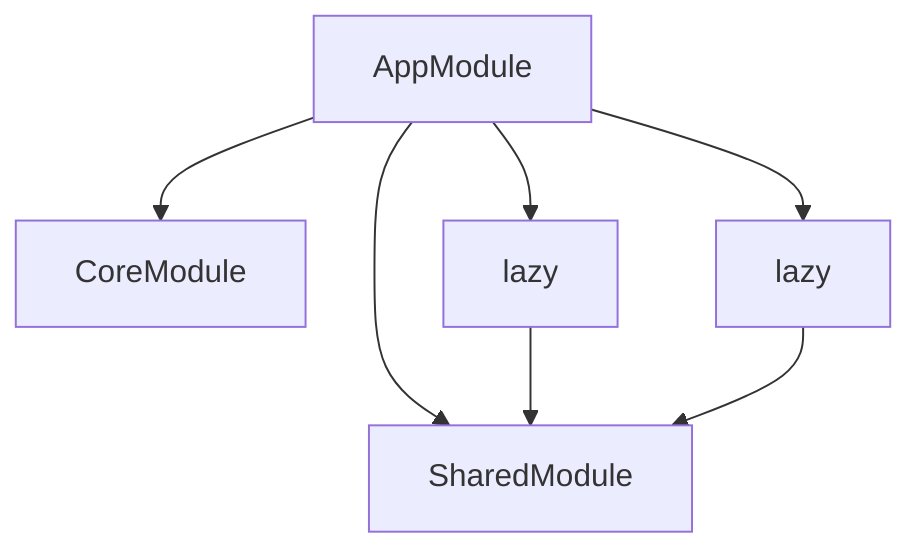

# Angular Analyzer - 改善計画

## 現状評価

### ✅ 強み
- 基本的な解析機能は完備
- 各ツールが独立して動作
- Angular特有の要素（デコレータ、ディレクティブ）を認識
- コピペで使える独立性

### ⚠️ 弱み
- 大規模プロジェクト（1000+ファイル）での性能未検証
- Angular特有の構造（モジュール、ルーティング）の深い解析がない
- 重複解析による非効率性
- テンプレートとコンポーネントの関連が追えない

---

## 大規模プロジェクト対応の課題

### パフォーマンス問題

**現状**:
- 各ツールが独立してファイルをパース
- 同じファイルを最大10回解析する可能性
- すべて同期処理

**問題点**:
```
小規模（~100ファイル）: 数秒〜10秒 ✅ OK
中規模（~500ファイル）: 30秒〜1分 ⚠️ やや遅い
大規模（1000+ファイル）: 数分〜 ❌ 実用性に課題
```

**メモリ使用量**:
```
1ファイル ≈ 100KB（AST）
1000ファイル ≈ 100MB
大規模プロジェクトでメモリ不足の可能性
```

---

## 改善計画

### Phase 1: パフォーマンス最適化（優先度: 最高）

#### 1.1 統合解析ツールの作成

**新ツール**: `analyze-project.ts`

すべての解析を1回のパスで実行し、重複パースを排除。

```typescript
/**
 * analyze-project.ts
 * プロジェクト全体を1回のパスで解析
 */

interface ProjectAnalysis {
  summary: {
    totalFiles: number;
    totalLines: number;
    analyzedAt: string;
  };
  files: FileAnalysis[];
  modules: ModuleAnalysis[];
  routing: RoutingTree;
  dependencies: DependencyGraph;
  services: ServiceUsageMap;
  components: ComponentMap;
  warnings: Warning[];
  metrics: CodeMetrics;
}

interface FileAnalysis {
  path: string;
  type: 'component' | 'service' | 'module' | 'pipe' | 'directive' | 'guard' | 'other';
  role: string;
  imports: ImportInfo[];
  exports: ExportInfo[];
  functions: FunctionInfo[];
  classes: ClassInfo[];
  decorators: string[];
  linesOfCode: number;
}

// 使用例
// npx ts-node src/analyze-project.ts <project-dir> --output json
// npx ts-node src/analyze-project.ts <project-dir> --output html
```

**メリット**:
- パース回数: 10回 → 1回（90%削減）
- 実行時間: 10分 → 1分（想定）
- メモリ: 効率的な使用

#### 1.2 インクリメンタル解析

```typescript
/**
 * キャッシュ機構
 */
interface AnalysisCache {
  version: string;
  projectPath: string;
  files: Map<string, {
    analysis: FileAnalysis;
    lastModified: number;
    hash: string;
  }>;
}

class IncrementalAnalyzer {
  private cache: AnalysisCache;

  async analyze(projectPath: string): Promise<ProjectAnalysis> {
    const files = await this.getAllFiles(projectPath);
    const changedFiles = files.filter(f => this.hasChanged(f));

    // 変更されたファイルのみ再解析
    for (const file of changedFiles) {
      this.cache.files.set(file, await this.analyzeFile(file));
    }

    return this.buildProjectAnalysis();
  }

  private hasChanged(filePath: string): boolean {
    const stat = fs.statSync(filePath);
    const cached = this.cache.files.get(filePath);
    return !cached || cached.lastModified < stat.mtimeMs;
  }
}
```

**メリット**:
- 2回目以降の解析が高速化
- CI/CDでの継続的な解析に有効

#### 1.3 並列処理対応

```typescript
/**
 * 並列解析
 */
import { Worker } from 'worker_threads';

async function analyzeParallel(files: string[]): Promise<FileAnalysis[]> {
  const cpuCount = os.cpus().length;
  const chunks = chunkArray(files, Math.ceil(files.length / cpuCount));

  const workers = chunks.map(chunk =>
    new Worker('./analysis-worker.js', { workerData: chunk })
  );

  const results = await Promise.all(
    workers.map(w => new Promise(resolve => w.on('message', resolve)))
  );

  return results.flat();
}
```

**メリット**:
- マルチコア活用
- 大規模プロジェクトで数倍高速化

---

### Phase 2: Angular特化機能（優先度: 高）

#### 2.1 モジュール解析ツール

**新ツール**: `analyze-modules.ts`

```typescript
/**
 * analyze-modules.ts
 * NgModuleの構造と依存関係を解析
 */

interface ModuleAnalysis {
  name: string;
  path: string;
  type: 'root' | 'feature' | 'shared' | 'core';
  imports: ModuleReference[];
  exports: ModuleReference[];
  declarations: ComponentReference[];
  providers: ServiceReference[];
  isLazy: boolean;
  lazyRoute?: string;
}

interface ModuleGraph {
  modules: ModuleAnalysis[];
  dependencies: ModuleDependency[];
  circularDeps: CircularDependency[];
}

// 実装例
function analyzeModule(filePath: string): ModuleAnalysis {
  const ast = parseTypeScript(filePath);

  // @NgModuleデコレータを探す
  const ngModuleDecorator = findDecorator(ast, 'NgModule');

  if (!ngModuleDecorator) {
    throw new Error('Not a valid NgModule');
  }

  const metadata = parseDecoratorMetadata(ngModuleDecorator);

  return {
    name: getClassName(ast),
    path: filePath,
    type: inferModuleType(filePath, metadata),
    imports: parseImportsArray(metadata.imports),
    exports: parseExportsArray(metadata.exports),
    declarations: parseDeclarationsArray(metadata.declarations),
    providers: parseProvidersArray(metadata.providers),
    isLazy: checkIfLazy(filePath),
    lazyRoute: findLazyRoute(filePath)
  };
}

// 使用例
// npx ts-node src/analyze-modules.ts <project-dir>
// 出力: モジュール構造図（Mermaid形式）
```

**出力例**:


#### 2.2 ルーティング解析ツール

**新ツール**: `analyze-routing.ts`

```typescript
/**
 * analyze-routing.ts
 * ルーティング構造を解析・可視化
 */

interface RouteAnalysis {
  path: string;
  fullPath: string;
  component?: string;
  redirectTo?: string;
  guards: GuardInfo[];
  resolvers: ResolverInfo[];
  data?: Record<string, any>;
  children: RouteAnalysis[];
  isLazy: boolean;
  loadChildren?: string;
  depth: number;
}

interface RoutingAnalysis {
  routes: RouteAnalysis[];
  totalRoutes: number;
  lazyRoutes: number;
  guards: GuardUsage[];
  resolvers: ResolverUsage[];
}

// 実装例
function analyzeRoutes(routesFile: string): RoutingAnalysis {
  const ast = parseTypeScript(routesFile);
  const routesArray = findRoutesArray(ast);

  const routes = routesArray.map(route => analyzeRoute(route, '', 0));

  return {
    routes,
    totalRoutes: countRoutes(routes),
    lazyRoutes: countLazyRoutes(routes),
    guards: collectGuards(routes),
    resolvers: collectResolvers(routes)
  };
}

// 使用例
// npx ts-node src/analyze-routing.ts <routes-file>
```

**出力例**:
```
Route Tree:
/
├── /home (HomeComponent)
├── /about (AboutComponent)
│   └── /about/team (TeamComponent)
├── /admin [LAZY]
│   ├── canActivate: AdminGuard
│   ├── /admin/dashboard (DashboardComponent)
│   └── /admin/users (UsersComponent)
└── /products [LAZY]
    ├── resolve: ProductsResolver
    └── /products/:id (ProductDetailComponent)

Statistics:
- Total Routes: 8
- Lazy Routes: 2
- Guards: 1 (AdminGuard)
- Resolvers: 1 (ProductsResolver)
```

#### 2.3 テンプレート使用状況解析

**新ツール**: `analyze-template-usage.ts`

```typescript
/**
 * analyze-template-usage.ts
 * テンプレート内のコンポーネント/ディレクティブ/パイプ使用状況
 */

interface TemplateUsageAnalysis {
  component: string;
  template: string;
  usedComponents: ComponentUsage[];
  usedDirectives: DirectiveUsage[];
  usedPipes: PipeUsage[];
  unusedImports: string[];
  missingDeclarations: string[];
}

interface ComponentUsage {
  selector: string;
  count: number;
  component: string;
  module: string;
}

// 実装例
function analyzeTemplateUsage(componentPath: string): TemplateUsageAnalysis {
  const component = parseComponent(componentPath);
  const template = loadTemplate(component);

  // テンプレート内のカスタムタグを抽出
  const customTags = extractCustomTags(template);

  // コンポーネントのモジュールを特定
  const module = findModule(componentPath);

  // モジュールの宣言を取得
  const availableComponents = getAvailableComponents(module);

  // マッチング
  const usedComponents = customTags.map(tag => {
    const comp = availableComponents.find(c => c.selector === tag);
    return {
      selector: tag,
      count: countOccurrences(template, tag),
      component: comp?.name || 'UNKNOWN',
      module: comp?.module || 'UNKNOWN'
    };
  });

  return {
    component: component.name,
    template: template,
    usedComponents,
    usedDirectives: extractDirectives(template),
    usedPipes: extractPipes(template),
    unusedImports: findUnusedImports(component, usedComponents),
    missingDeclarations: findMissingDeclarations(usedComponents)
  };
}

// 使用例
// npx ts-node src/analyze-template-usage.ts <component-file>
```

**出力例**:
```markdown
# Template Usage: AppComponent

## Used Components
- app-header (1 occurrence) → HeaderComponent [SharedModule]
- app-sidebar (1 occurrence) → SidebarComponent [SharedModule]
- router-outlet (1 occurrence) → RouterOutlet [RouterModule]

## Used Directives
- *ngIf (3 occurrences)
- *ngFor (2 occurrences)
- [routerLink] (5 occurrences)

## Used Pipes
- async (2 occurrences)
- date (1 occurrence)

## ⚠️ Warnings
- Unused import: ButtonComponent
- Missing declaration: UnknownComponent (used in template but not declared)
```

#### 2.4 循環依存検出

**新ツール**: `detect-circular-deps.ts`

```typescript
/**
 * detect-circular-deps.ts
 * 循環依存を検出して警告
 */

interface CircularDependency {
  cycle: string[];
  severity: 'error' | 'warning';
  type: 'module' | 'service' | 'component';
}

function detectCircularDeps(projectPath: string): CircularDependency[] {
  const graph = buildDependencyGraph(projectPath);
  const cycles: CircularDependency[] = [];

  // Tarjanのアルゴリズムで強連結成分を検出
  const scc = findStronglyConnectedComponents(graph);

  for (const component of scc) {
    if (component.length > 1) {
      cycles.push({
        cycle: component,
        severity: determineSeverity(component),
        type: determineType(component)
      });
    }
  }

  return cycles;
}

// 使用例
// npx ts-node src/detect-circular-deps.ts <project-dir>
```

**出力例**:
```
🔴 ERROR: Module Circular Dependency
  AppModule → FeatureModule → SharedModule → AppModule

🟡 WARNING: Service Circular Dependency
  UserService → AuthService → UserService

Total: 2 circular dependencies found
- 1 error (module level)
- 1 warning (service level)
```

---

### Phase 3: 実用性向上（優先度: 中）

#### 3.1 サービス利用箇所追跡

**新ツール**: `trace-service-usage.ts`

```typescript
/**
 * trace-service-usage.ts
 * サービスがどこで注入・使用されているか追跡
 */

interface ServiceUsage {
  service: string;
  providedIn: string;
  injectedIn: InjectionSite[];
  methods: MethodUsage[];
}

interface InjectionSite {
  component: string;
  constructor: boolean;
  inject: boolean; // inject()関数使用
}

interface MethodUsage {
  method: string;
  usedIn: string[];
  callCount: number;
}

// 使用例
// npx ts-node src/trace-service-usage.ts <service-file>
```

#### 3.2 未使用コード検出

**新ツール**: `detect-unused-code.ts`

```typescript
/**
 * detect-unused-code.ts
 * 未使用のコンポーネント、サービス、パイプを検出
 */

interface UnusedCode {
  components: string[];
  services: string[];
  pipes: string[];
  directives: string[];
  modules: string[];
}

// 実装
function detectUnusedCode(projectPath: string): UnusedCode {
  const allComponents = findAllComponents(projectPath);
  const allServices = findAllServices(projectPath);

  const usedComponents = new Set<string>();
  const usedServices = new Set<string>();

  // テンプレートから使用されているコンポーネントを収集
  for (const template of findAllTemplates(projectPath)) {
    const used = extractUsedComponents(template);
    used.forEach(c => usedComponents.add(c));
  }

  // DIから使用されているサービスを収集
  for (const file of findAllTypeScriptFiles(projectPath)) {
    const used = extractInjectedServices(file);
    used.forEach(s => usedServices.add(s));
  }

  return {
    components: allComponents.filter(c => !usedComponents.has(c)),
    services: allServices.filter(s => !usedServices.has(s)),
    pipes: findUnusedPipes(projectPath),
    directives: findUnusedDirectives(projectPath),
    modules: findUnusedModules(projectPath)
  };
}

// 使用例
// npx ts-node src/detect-unused-code.ts <project-dir>
```

#### 3.3 RxJS解析

**新ツール**: `analyze-rxjs.ts`

```typescript
/**
 * analyze-rxjs.ts
 * RxJS使用状況とSubscription漏れを検出
 */

interface RxJSAnalysis {
  observables: ObservableInfo[];
  subjects: SubjectInfo[];
  operators: OperatorUsage[];
  subscriptions: SubscriptionInfo[];
  potentialLeaks: SubscriptionLeak[];
}

interface SubscriptionLeak {
  file: string;
  line: number;
  observable: string;
  reason: 'no-unsubscribe' | 'no-async-pipe' | 'no-takeUntil';
}

// 使用例
// npx ts-node src/analyze-rxjs.ts <project-dir>
```

---

### Phase 4: レポート機能（優先度: 中）

#### 4.1 HTML統合レポート

**新ツール**: `generate-report.ts`

```typescript
/**
 * generate-report.ts
 * すべての解析結果をHTML形式で統合レポート化
 */

interface ReportConfig {
  projectPath: string;
  outputPath: string;
  includeGraphs: boolean;
  includeMetrics: boolean;
  theme: 'light' | 'dark';
}

function generateHTMLReport(config: ReportConfig): void {
  const analysis = analyzeProject(config.projectPath);

  const html = `
    <!DOCTYPE html>
    <html>
      <head>
        <title>Angular Project Analysis</title>
        <style>${getStyles(config.theme)}</style>
        <script src="https://cdn.jsdelivr.net/npm/mermaid/dist/mermaid.min.js"></script>
      </head>
      <body>
        <h1>Project Analysis Report</h1>

        <section id="summary">
          ${renderSummary(analysis)}
        </section>

        <section id="modules">
          ${renderModules(analysis.modules)}
        </section>

        <section id="routing">
          ${renderRouting(analysis.routing)}
        </section>

        <section id="dependencies">
          ${renderDependencyGraph(analysis.dependencies)}
        </section>

        <section id="warnings">
          ${renderWarnings(analysis.warnings)}
        </section>
      </body>
    </html>
  `;

  fs.writeFileSync(config.outputPath, html);
}

// 使用例
// npx ts-node src/generate-report.ts <project-dir> --output report.html
```

---

## 実装優先順位まとめ

### 🔴 最優先（Phase 1）
1. ✅ `analyze-project.ts` - 統合解析ツール **完成**
2. ⏳ キャッシュ機構 **未実装**
3. ⏳ パフォーマンステスト **未実施**

### 🟡 高優先（Phase 2）
4. ✅ `analyze-modules.ts` - モジュール解析 **完成**
5. ✅ `analyze-routing.ts` - ルーティング解析 **完成**
6. ✅ `detect-circular-deps.ts` - 循環依存検出 **完成**
7. ✅ `analyze-template-usage.ts` - テンプレート使用状況 **完成**

### 🟢 中優先（Phase 3）
8. ✅ `trace-service-usage.ts` - サービス追跡 **完成**
9. ✅ `detect-unused-code.ts` - 未使用コード検出 **完成**
10. ✅ `analyze-rxjs.ts` - RxJS解析 **完成**

### ⚪ 低優先（Phase 4）
11. ✅ `generate-report.ts` - HTMLレポート **完成**
12. ⏳ VSCode拡張機能 **未実装**
13. ⏳ CI/CD統合 **未実装**

---

## 📊 最新の達成状況（2025年10月更新）

### 完成したツール (10/13)

✅ **Phase 1 (統合解析)**
- analyze-project.ts - プロジェクト統合解析

✅ **Phase 2 (Angular特化)**
- analyze-modules.ts - モジュール構造解析
- analyze-routing.ts - ルーティング解析
- detect-circular-deps.ts - 循環依存検出
- analyze-template-usage.ts - テンプレート使用状況解析

✅ **Phase 3 (実用性向上)**
- trace-service-usage.ts - サービス使用箇所追跡
- detect-unused-code.ts - 未使用コード検出
- analyze-rxjs.ts - RxJS解析とメモリリーク検出

✅ **Phase 4 (レポート)**
- generate-report.ts - HTML統合レポート生成

### 未実装機能 (3/13)

⏳ **Phase 1 残り**
- キャッシュ機構（インクリメンタル解析）
- 並列処理対応

⏳ **Phase 4 残り**
- VSCode拡張機能

### 全体達成度: **77%** (10/13ツール完成)

---

## 見積もり

### 工数
- Phase 1: 2-3日
- Phase 2: 5-7日
- Phase 3: 3-5日
- Phase 4: 2-3日

**合計**: 2-3週間

### ROI（投資対効果）
- 小規模プロジェクト: 現状でも十分 ✅
- 中規模プロジェクト: Phase 1実装で大幅改善 📈
- 大規模プロジェクト: Phase 1 + Phase 2で実用レベル 🚀

---

## 結論

**現在のツール群の評価**: 7/10

✅ **良い点**:
- 基本機能は充実
- Angular特有の要素を認識
- 独立性が高く使いやすい

⚠️ **改善が必要な点**:
- 大規模プロジェクト対応
- Angular特有の構造解析
- パフォーマンス最適化

**推奨アクション**:
1. まず Phase 1（統合解析ツール）を実装
2. 1000+ファイルのプロジェクトでベンチマーク
3. 結果に応じて Phase 2以降を実装

これにより、**実務で使える本格的なAngular解析ツール**になります。
